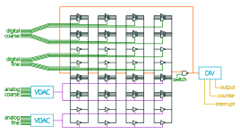

# Frequency Synthesizer peripheral

Author: htfab

Peripheral index: 5

## What it does

Generates a tunable clock signal from a current-starved ring oscillator
exploiting the analog properties of tri-state inverter standard cells
(inspired by Harald Pretl's "analigital" temperature sensor on TT03).

Can be used for:
- rough temperature measurements by counting ticks per time unit
  (using the crystal-based system clock)
- more precise temperature measurements by using a feedback loop to
  tune the frequency close to the system clock and then looking up
  the tuning parameters in a table
- rough synthesis of higher frequencies by tuning a divided
  frequency close to some different division of the system clock
- more precise synthesis of lower frequencies by using an FLL/PLL
  style feedback mechanism implemented in software

Tuning parameters are unary (i.e. thermometer-coded) 32-bit numbers
to guarantee the monotonicity needed for certain applications.

## Register map

| Address | Name  | Access | Description                                                         |
|---------|-------|--------|---------------------------------------------------------------------|
| 0x00    | DATA  | R/W    | Digital coarse tuning                                               |
| 0x04    | DATA  | R/W    | Digital fine tuning                                                 |
| 0x08    | DATA  | R/W    | Analog coarse tuning via VDAC                                       |
| 0x0c    | DATA  | R/W    | Analog fine tuning via VDAC                                         |
| 0x10    | DATA  | R/W    | [3:2] invert VDACs, [1] enable interrupts, [0] kill switch          |
| 0x14    | DATA  | R/W    | [4:0] power of 2 clock divider for output pins                      |
| 0x18    | DATA  | R/W    | [4:0] power of 2 clock divider for counter                          |
| 0x1c    | DATA  | R/W    | [4:0] power of 2 clock divider for interrupts                       |
| 0x20    | DATA  | R      | Counter value                                                       |

## How to test

- Set the kill switch to enabled
- Set the output clock divider to a high value (25-30) to allow observing
  frequency changes with the naked eye
- Vary the tuning the parameters and see how the output signal behaves

## External hardware

None
